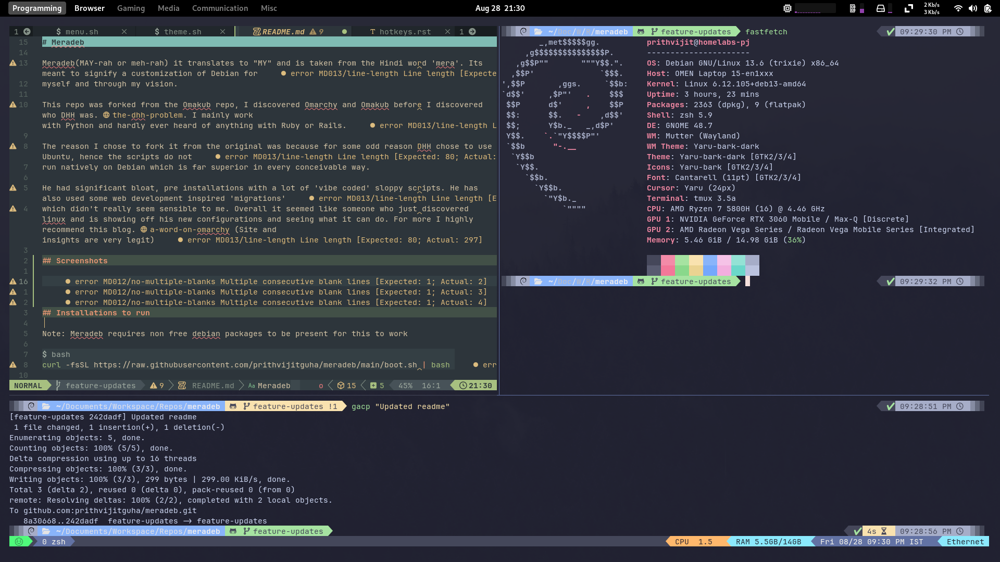
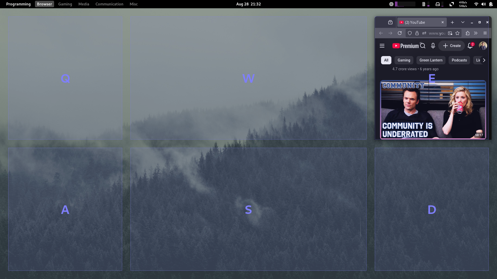
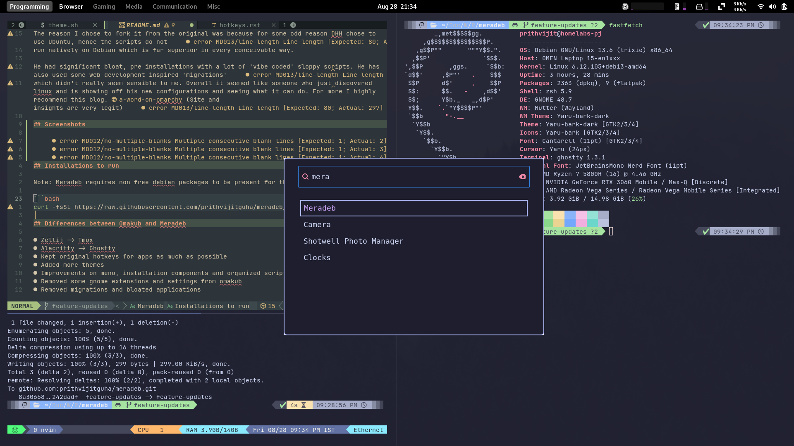

# Meradeb

Meradeb(MAY-rah or meh-rah) it translates to "MY" and is taken from the Hindi word 'mera'. Its meant to signify a customization of Debian for
myself and through my vision.

This repo was forked from the Omakub repo, I discovered Omarchy and Omakub before I discovered who DHH was. [the-dhh-problem](https://davidcel.is/articles/the-dhh-problem). I mainly work with Python and hardly ever heard of anything with Ruby or Rails.

The reason I chose to fork it from the original was because for some odd reason DHH chose to use Ubuntu, hence the scripts do not
run natively on Debian which is far superior in every conceivable way.

He had significant bloat, pre installations with a lot of 'vibe coded' sloppy scripts. He has also used some web development inspired 'migrations'
which didn't really seem sensible to me. Overall it seemed like someone who just discovered linux and is showing off his new configurations and seeing what it can do. For more I highly recommend this blog. [a-word-on-omarchy](https://マリウス.com/a-word-on-omarchy/) (Site and insights are very legit)

## Differences between Omakub and Meradeb

- Zellij -> Tmux
- Alacritty -> Ghostty
- Ulauncher -> Wofi
- Kept original hotkeys for apps as much as possible
- Added more themes
- Improvements on menu, installation components and organized scripts.
- Added improvements with gnome auto move windows and workspace naming.
- Removed some gnome extensions and settings from omakub
- Removed migrations and bloated applications

## Screenshots

To view the docs please check this page
[https://meradeb.readthedocs.io/en/latest/](https://meradeb.readthedocs.io/en/latest/)
